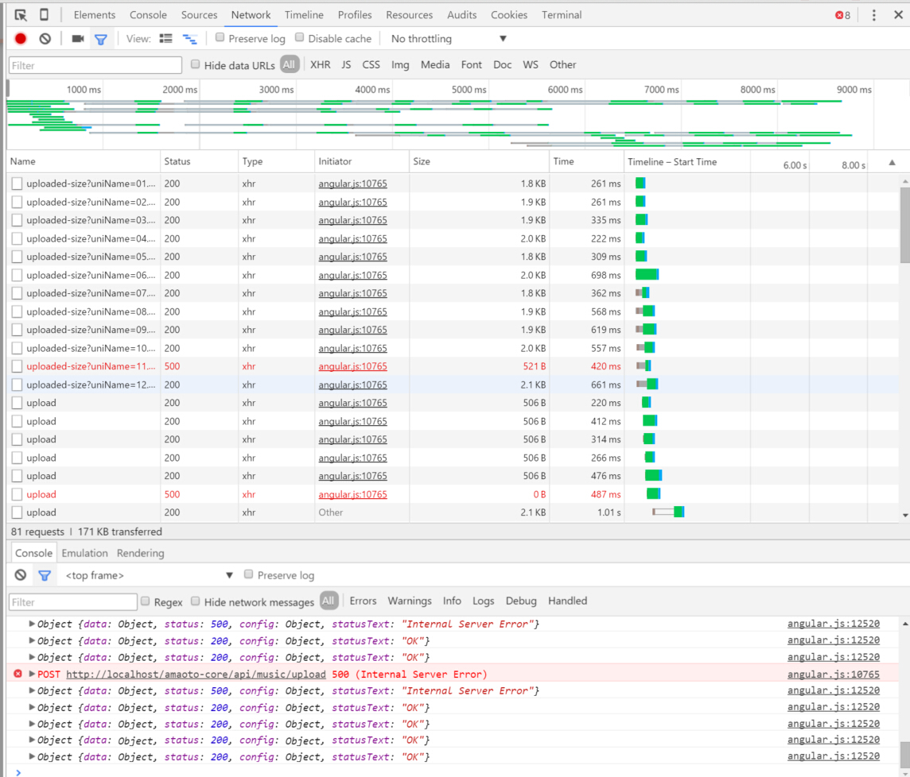
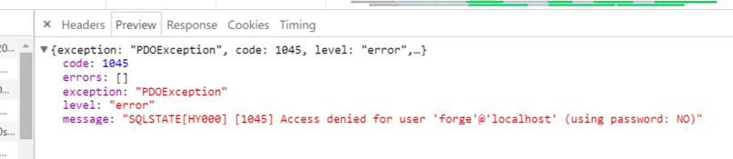

title: Laravel 在极高的瞬间并发时出现的问题
date: 2016-01-17 14:36
---

又踩了了一个坑

之前曾经出现过 laravel 在极高的瞬间并发的时候，会出现session状态丢失的问题。原因是laravel中，session默认储存在文件系统，在瞬间并发时，可能由于文件系统io的原因，导致session文件读写失败，进而造成session丢失。

这个问题我当时是直接把session存放在cookie或者数据库中解决了。

然而今天又出现了新状况，也是瞬间高并发的锅。



如图，这是在ngjs下的一个并发上传的控件，会同时并发上传选择的文件，且在上传前会并发请求以查询文件是否已上传，以完成续传功能。

1秒内大概有15个并发连接

在这几个并发连接中，有部分会发生错误，扔我一脸500



具体报错是^

然而，我明显没设错mysql账号密码啦

而且我.env文件中数据库相关的设置是：

```ini
    DB_HOST=localhost
    DB_DATABASE=amaoto-core
    DB_USERNAME=root
    DB_PASSWORD=
```

然而报错是说我用了forge作为用户名连接mysql


等等，forge好熟悉啊

这货不就是laravel配置文件中的连mysql的默认用户名咩

检查config/database.php

```php
    'mysql' => [
            'driver'    => 'mysql',
            'host'      => env('DB_HOST', 'localhost'),
            'database'  => env('DB_DATABASE', 'forge'),
            'username'  => env('DB_USERNAME', 'forge'),
            'password'  => env('DB_PASSWORD', ''),
            'charset'   => 'utf8',
            'collation' => 'utf8_unicode_ci',
            'prefix'    => '',
            'strict'    => false,
        ]，
```

果然

也就是说，`env('DB_USERNAME', 'forge')` 没能成功读取`.env`文件

参考之前session状态丢失的解决方法，那就不读取.env咯

然而不用`.env`的话，把数据库账密写在`config/database.php`也不科学

于是翻了翻文档

发现`artisan`指令：`config:cache` 可缓存配置文件

马上执行试试，重新测试一看，完美解决。

嘛，所以难得的更新了blog做个笔记ww
